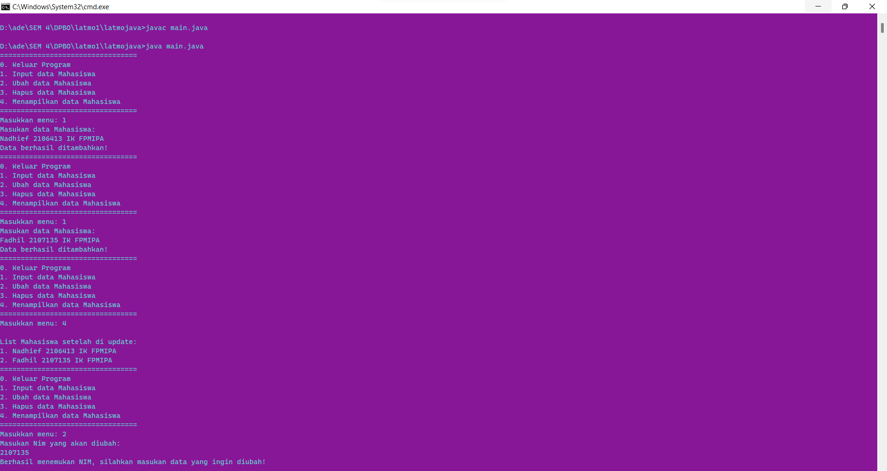
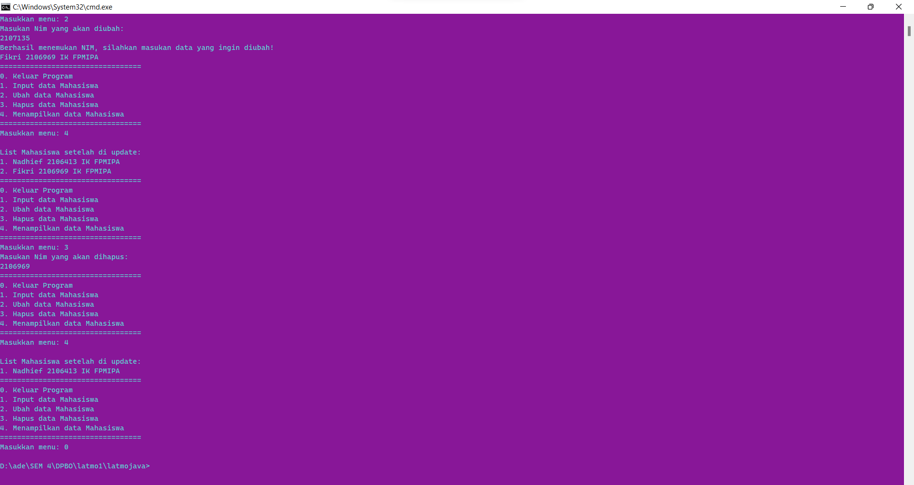
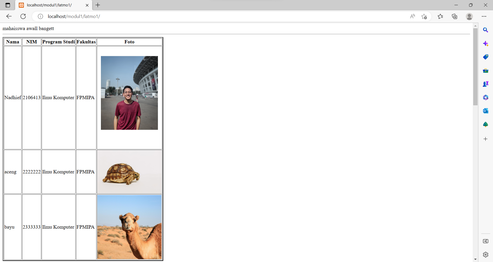
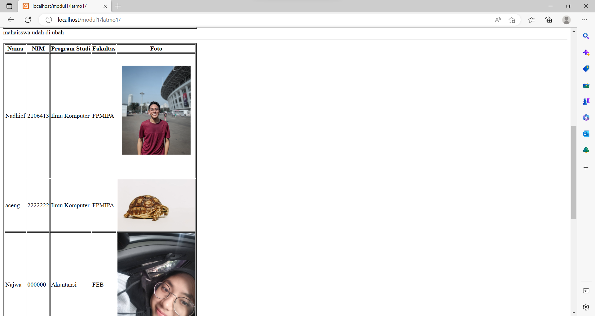
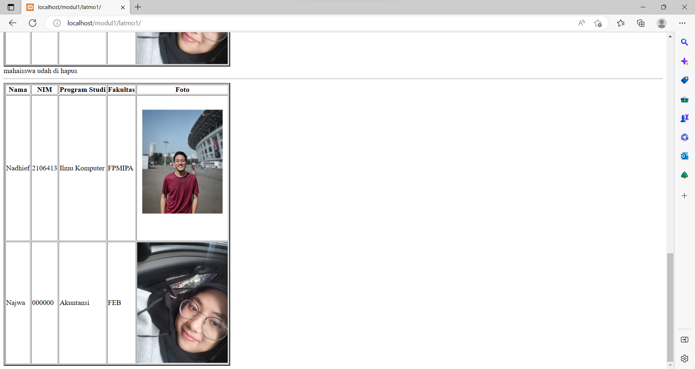

## Janji
Saya Nadhief Athallah Isya NIM 2106413 mengerjakan soal Latihan 1
dalam mata kuliah Desain Pemrograman Berorientasi Objek untuk keberkahanNya
maka saya tidak melakukan kecurangan seperti yang telah dispesifikasikan.
Aamiin.

# Tugas LATIHAN1DPBO2023
Buatlah program berbasis OOP menggunakan bahasa pemrograman C++, Java, Python, dan PHP yang menampilkan informasi daftar mahasiswa (sekumpulan objek mahasiswa) dan memiliki fitur menambah, mengubah, dan menghapus data. Setiap mahasiswa memiliki data nama, NIM, program studi, fakultas, dan foto profil (khusus bahasa PHP).

File README berisi desain program, penjelasan alur, dan dokumentasi saat program dijalankan (screenshot/screen record, pilih salah satu bahasa sebagai contoh)

Submit link repository pada form berikut: [Form Pengumpulan](https://forms.gle/rvb1hKxbQVuYNbhKA) 

## Desain Program cpp
Desain yang saya buat menggunakan 2 Class:
* Mhs.cpp
* Crud.cpp

->Class Mahasiswa memiliki total 4 atribut:
* **nim** -> NIM mahasiswa, tipe data string
* **name** -> nama mahasiswa, tipe data string
* **ps** -> program studi mahasiswa, tipe data string
* **fakultas** -> Fakultas mahasiswa, tipe data string

Di class Mhs terdapat setter getter masing asing atribut

->Class Crud tidak memiliki atribut sama sekali namun terdapat 3 method:

* **input** -> menginput dan menambah data Mahasiswa ke list
* **hapus** -> menghapus data Mahasiswa berdasarkan NIM
* **ubah** -> mengubah data Mahasiswa berdasarkan NIM lalu  input data baru seperti biasa

mengapa tida ada method tampil karena setiap habis melakukan inputan list mahasiswa langsung di print

## Desain Program java
Desain yang saya buat menggunakan 2 Class:
* Mhs.cpp
* Crud.cpp

->Class Mahasiswa memiliki total 4 atribut:
* **nim** -> NIM mahasiswa, tipe data string
* **name** -> nama mahasiswa, tipe data string
* **ps** -> program studi mahasiswa, tipe data string
* **fakultas** -> Fakultas mahasiswa, tipe data string

Di class Mhs terdapat setter getter masing asing atribut

->Class Crud tidak memiliki atribut sama sekali namun terdapat 4 method:

* **mashok** -> menginput dan menambah data Mahasiswa ke list
* **ingpomaseh** -> menampilkan data Mahasiswa dari list
* **hapus** -> menghapus data Mahasiswa berdasarkan NIM
* **ubah** -> mengubah data Mahasiswa berdasarkan NIM lalu  input data baru seperti biasa

## Desain Program python
Desain yang saya buat menggunakan 2 Class:
* Mhs.cpp
* Crud.cpp

->Class Mahasiswa memiliki total 4 atribut:
* **nim** -> NIM mahasiswa, tipe data string
* **name** -> nama mahasiswa, tipe data string
* **ps** -> program studi mahasiswa, tipe data string
* **fakultas** -> Fakultas mahasiswa, tipe data string

Di class Mhs terdapat setter getter masing asing atribut

->Class Crud tidak memiliki atribut sama sekali namun terdapat 2 method:

* **hapus** -> menghapus data Mahasiswa berdasarkan NIM
* **ubah** -> mengubah data Mahasiswa berdasarkan NIM lalu  input data baru seperti biasa

mengapa tida ada method tampil karena setiap habis melakukan inputan list mahasiswa langsung di print

## Desain Program php
Desain yang saya buat menggunakan 2 class:
* Human.php
* Crud.php

-> class Human memiliki total 5 atribut:
* **nim** -> NIM mahasiswa
* **name** -> nama mahasiswa
* **ps** -> program studi mahasiswa
* **fakultas** -> Fakultas mahasiswa
* **foto** -> Foto mahasiswa

Di class Human terdapat setter getter masing asing atribut

-> class Crud memiliki satu atribut berupa array untuk menampung data mahasiswa:
* **list**

-> class Crud memiliki 4 method:
* **input** -> menginput dan menambah data Mahasiswa ke list
* **tampil** -> menampilkan data Mahasiswa dari list
* **hapus** -> menghapus data Mahasiswa berdasarkan NIM
* **ubah** -> mengubah data Mahasiswa berdasarkan NIM lalu  

## Alur Program
* **cpp**
    
    1. masukan jumlah data yang akan di masukan
    2. input datanya
    3. ketik 1 untuk ubah
    4. lalu masukan nimnya
    5. ketik 2 untuk hapus
    6. lalu masukan nimnya
    7. maka list mahasiswa akan muncul setelah diubah/dihapus 
    8. keluar program
* **python**
    1. masukan jumlah data yang akan di masukan
    2. input datanya
    3. masukan nim yang akan diubah datanya
    4. langsung print list mhs setelah diubah
    5. masukan nim yang akan diubah datanya
    6. langsug print list mhs setelah dihapus
    7. keluar program
* **java**
    1. diberi pilihan menu
    2. jika ketik 1 maka akan input data
    3. jika ketik 2 maka akan ubah data
    4. jika ketik 3 maka akan hapus data
    5. jika ketik 4 maka akan menampilkan data
    6. jika ketik 0 maka akan keluar program
* **php**

    data mahasiswal di input hardcode dalam program, lalu menjalnkan method ubah, lalu menjalankan method hapus.

## Dokumentasi
**Program java**

**Program php**

